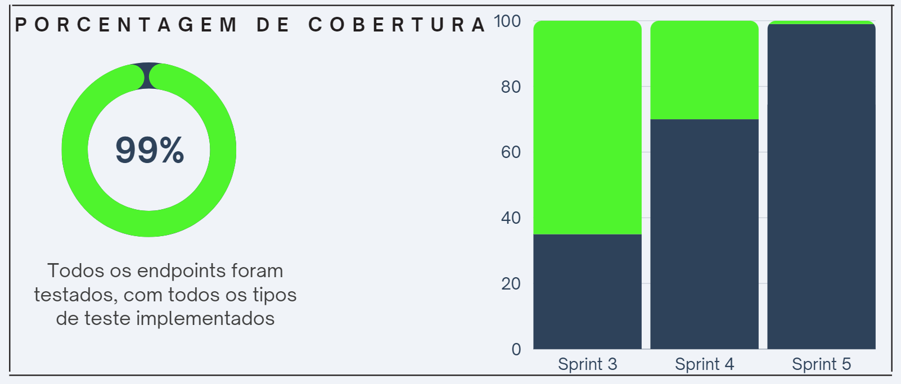
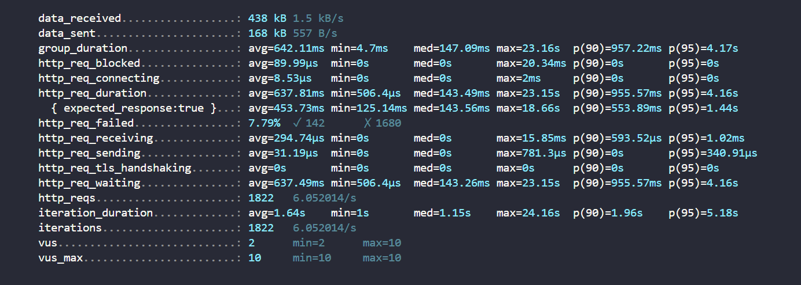

# Plano e Definição de Testes

Este documento delineia a estratégia e metodologia para a realização de todos os  testes do sistema 

 # 1. Testes Unitarios 


## Gestão de importação e Validade de dados do cliente

### 1. Teste de download do modelo de planilha
- **Objetivo**: confirmar que o usuário pode baixar o modelo de planilha personalizado sem erros.
- **Entrada**: usuário clica no link ou botão de download do modelo de planilha.
- **Resultado esperado**: o download do arquivo inicia imediatamente, e o arquivo baixado corresponde ao modelo de planilha atualizado, contendo as colunas para `name`, `email`, `phone`, `CPF`, `Empresa`, `Company` por e-mail.

### 2. Teste de importação de planilha
- **Objetivo**: avaliar a capacidade do sistema de importar corretamente uma planilha preenchida com dados de clientes.
- **Entrada**: upload de uma planilha preenchida seguindo o modelo fornecido pelo sistema.
- **Variáveis**: planilha com dados válidos, planilha com células vazias, e planilha com formatos de dados incorretos.
- **Resultado esperado**: para dados válidos, a importação é bem-sucedida. Para células vazias ou formatos de dados incorretos, o sistema exibe mensagens de erro específicas.

### 3. Teste de validação dos dados importados
- **Objetivo**: garantir que o sistema valida os dados importados de acordo com regras de negócio específicas antes de confirmar a importação.
- **Entrada**: dados dos clientes importados via planilha.
- **Cenários de Teste**: importação de dados com e-mails duplicados, CPFs inválidos, e datas de nascimento futuras.
- **Resultado esperado**: o sistema identifica e relata erros específicos, bloqueando a importação até que os problemas sejam resolvidos.

### 4. Teste de limites de importação
- **Objetivo**: verificar como o sistema lida com planilhas que excedem o número máximo permitido de linhas ou colunas.
- **Entrada**: uma planilha com número de linhas ou colunas superior ao limite especificado pelo sistema.
- **Resultado esperado**: o sistema deve exibir uma mensagem de erro indicando que o arquivo excede o limite permitido e orientando sobre como proceder.

### 5. Teste de formato de arquivo de planilha
- **Objetivo**: confirmar que o sistema aceita apenas os formatos de arquivo de planilha especificados (por exemplo, .xls, .xlsx).
- **Entrada**: tentativa de upload de arquivos em formatos não suportados.
- **Resultado esperado**: mensagem de erro informando o usuário sobre os formatos de arquivo aceitos.


## Monitoramento em tempo real e Registro de resultados da distribuição

### 1. Teste de exibição do resumo de distribuição
- **Objetivo**: verificar se o resumo da distribuição reflete com precisão os dados importados em tempo real.
- **Entrada**: finalização da importação dos dados dos clientes.
- **Resultado esperado**: o resumo no lado direito da tela mostra a contagem exata de clientes que foram importados para a distribuição, incluindo quaisquer erros ou avisos relacionados à qualidade dos dados.

### 2. Teste de correspondência do resumo com a quantidade enviada
- **Objetivo**: assegurar que a quantidade de clientes listada no resumo após a importação corresponde exatamente à quantidade de registros válidos enviados.
- **Entrada**: dados dos clientes após a importação bem-sucedida.
- **Detalhamento**: comparação entre a quantidade de registros importados e a quantidade indicada no resumo.
- **Resultado esperado**: nenhuma discrepância entre a quantidade de clientes importados e a quantidade indicada no resumo.

### 3. Teste de distribuição de pesquisa

- **Objetivo**: confirmar a funcionalidade de distribuição de pesquisas via E-mail, incluindo modos anônimo e identificado.
- **Ação**: distribuir uma pesquisa utilizando o canal de E-mail para a base de clientes importada.
- **Resultado esperado**: registros da distribuição, incluindo quantidade de envios e entregas, são gerados conforme esperado.

### 4. Teste de salvamento dos resultados da distribuição

- **Objetivo**: validar a funcionalidade de salvamento dos resultados da distribuição, incluindo detalhes de sucesso e falhas na entrega.
- **Entrada**: comando do usuário para salvar os resultados da distribuição.
- **Detalhamento**: verificar se o sistema salva com precisão todos os detalhes da distribuição, incluindo a quantidade de e-mails enviados, a quantidade de e-mails entregues, a quantidade de falhas, e qualquer feedback de erro específico relacionado às falhas.
- **Resultado esperado**: os resultados da distribuição são salvos de forma que possam ser facilmente acessados e analisados para futuras referências e melhorias no processo de distribuição.

### 5. Teste de persistência dos resultados salvos

- **Objetivo**: garantir que os resultados da distribuição salvos permaneçam acessíveis e intactos após o logout ou reinicialização do sistema.
- **Ação**: salvar os resultados da distribuição, sair do sistema e então retornar para acessar os resultados salvos.
- **Resultado Esperado**: Os resultados salvos anteriormente são recuperados com precisão, sem perda de dados.

### 6. Teste de desempenho na importação

- **Objetivo**: avaliar o desempenho do sistema ao importar grandes volumes de dados.
- **Entrada**: importação de uma planilha de dados próxima ao limite máximo de capacidade.
- **Resultado esperado**: o sistema deve processar a importação dentro de um tempo aceitável, sem erros de timeout ou falhas.

### 7. Teste de segurança na importação de dados

- **Objetivo**: assegurar que o processo de importação de dados não seja vulnerável a injeções de SQL ou outros ataques que possam comprometer a segurança dos dados.
- **Entrada**: tentativa de importação de uma planilha contendo dados maliciosos ou código.
- **Resultado esperado**: o sistema deve sanitizar os dados de entrada, prevenindo qualquer tipo de injeção ou execução de código malicioso.

## Testes Automatizados

Com o objetivo de validar os diversos cenários previamente abordados, foi desenvolvido um conjunto de testes unitários utilizando a ferramenta Jest para verificar cada funcionalidade do sistema de forma automatizada e simplificada. O código reside no arquivo `2024-T0003-ES09-G05/backend/src/research/research.service.spec.ts`, onde a função `describe` foi criada para orquestrar a execução dos testes para cada funcionalidade da aplicação.

Essa abordagem facilita a identificação de eventuais falhas em diferentes partes do sistema. Se algum dos casos de teste não for atendido, um registro de erro será gerado, alertando o usuário sobre possíveis falhas. Isso promove uma abordagem proativa na detecção de problemas, contribuindo para a robustez e confiabilidade do sistema.

### Função Describe

Para melhor visualização da excução dos testes, é necessário entender melhor o funcionamento da função `describe`, que pode ser visualizada a seguir: 

```
describe('Testing sequence', () => {
    it('Should create a research based on CSV values ', async () => {
        const result = await researchService.parseCsv("uploads/50ac87ab9e2e4862476c6f8bc194073e", {
            title: "Teste",
            author: "Teste",
            product: "Teste"
        });
        expect(result.message).toEqual('Arquivo processado com sucesso e pesquisa criada!');

        idToDelete = (result as any).id;
    }, 30000);

    it('Should get all researchs', async () => {
        const result = await researchService.getAll();
        expect(result).toEqual(expect.arrayContaining([]));
    });

    it('Should get one research', async () => {
        console.log(idToDelete)
        const result = await researchService.getOne(idToDelete);
        expect(result).toEqual(expect.objectContaining({}));
    });

    it('Should get research status', async () => {
        const result = await researchService.getStatus(idToDelete);
        expect(result).toEqual(expect.objectContaining({}));
    });

    it('Should distribute one research', async () => {
        const result = await researchService.distribute(idToDelete);
        expect(result).toEqual(expect.objectContaining({}));
    });

    it('Should delete one research', async () => {
        const result = await researchService.delete(idToDelete);
        expect(result).toEqual(expect.objectContaining({}));
    });
  });
```
Como pode ser observado, a função segue uma sequência de cenários iniciada pela palavra reservada it, seguida pela descrição da funcionalidade a ser testada em cada cenário específico. Posteriormente, o método invoca a função a ser validada e compara o resultado obtido com um exemplo correto esperado para aquela função. Após a análise e registro dos resultados, são apresentadas todas as funções que falharam ou passaram no teste, proporcionando uma investigação detalhada para abordar qualquer problema identificado durante os testes. Essa abordagem possibilita uma compreensão aprofundada das deficiências encontradas, contribuindo para uma resolução eficaz e aprimoramento contínuo do sistema.

### Execução dos testes

Uma vez configurados corretamente os resultados esperados de cada método a ser testado, basta navegar pelo terminal até a pasta `2024-T0003-ES09-G05/backend` e executar o seguinte comando:

```
npm run test
```

Após a execução do comando, os resultados dos testes serão exibidos diretamente no terminal. Em caso de dúvidas ou problemas relacionados ao comando utilizado para executar os testes, é recomendável verificar os scripts definidos no arquivo `2024-T0003-ES09-G05/backend/package.json`. Certifique-se de que o comando executado está devidamente incluído na lista de scripts construídos, assegurando assim a correta execução dos testes. Essa prática facilita a manutenção e a compreensão do processo de teste, garantindo uma integração eficaz com o ambiente de desenvolvimento.


# 2. Testes de Integração

### Teste de Integração 1: Importação e Validação de Dados do Cliente

**Objetivo:** Verificar a capacidade do sistema de importar dados de clientes de uma planilha, validá-los e apresentar mensagens de erro para dados inválidos.

**Processos/Endpoints:**
- `/download-modelo`: Baixar o modelo de planilha para distribuição por e-mail.
- `/importacao-dados`: Enviar planilha preenchida para importação dos dados.

**Valores de Entrada:**
- Planilha preenchida corretamente com dados dos clientes (nome, e-mail, telefone, CPF, empresa) seguindo o modelo disponibilizado.
- Planilha com erros (e.g., formato de e-mail inválido, CPF incorreto).

**Resultado Esperado:**
- Para a planilha correta, o sistema deve importar os dados com sucesso, sem erros.
- Para a planilha com erros, o sistema deve identificar e reportar os campos inválidos, orientando sobre as correções necessárias.

### Teste de Integração 2: Monitoramento em Tempo Real e Registro de Resultados

**Objetivo:** Avaliar a funcionalidade de monitoramento em tempo real após a importação dos dados dos clientes e o registro dos resultados da distribuição de pesquisas.

**Processos/Endpoints:**
- `/iniciar-distribuicao`: Iniciar a distribuição da pesquisa para os clientes importados.
- `/monitoramento-tempo-real`: Exibir informações em tempo real sobre a distribuição.
- `/salvar-resultados-distribuicao`: Salvar os resultados da distribuição para análise posterior.

**Valores de Entrada:**
- Escolha do canal de distribuição (e.g., E-mail, Whatsapp, SMS link, Lista de links, Link, QR Code, Widget) após a importação dos dados dos clientes.

**Resultado Esperado:**
- O sistema deve apresentar um resumo detalhado na tela, mostrando em tempo real a quantidade de clientes incluídos na distribuição por e-mail e permitindo a verificação instantânea dessa quantidade.
- Os resultados da distribuição, incluindo quantidade de envios, entregas, aberturas de e-mail/pesquisa, respostas, tempo médio de resposta, devem ser precisamente registrados e disponíveis para salvamento.

  Para expandir a cobertura de testes de integração e garantir uma verificação mais completa das interações entre os componentes do sistema, podemos adicionar os seguintes testes, focando em outras áreas críticas do sistema baseado nos requisitos funcionais e no resumo do caso de uso:

### Teste de Integração 3: Distribuição de Pesquisas e Análise de Respostas

**Objetivo:** Assegurar que o sistema possa distribuir pesquisas através dos canais especificados e coletar análises de respostas de maneira eficaz.

**Processos/Endpoints:**
- `/distribuir-pesquisa`: Distribuir pesquisas para a base de clientes importada, através dos canais selecionados.
- `/coletar-respostas`: Coletar respostas recebidas dos clientes.
- `/analisar-respostas`: Analisar as respostas coletadas para gerar insights.

**Valores de Entrada:**
- Seleção de canal de distribuição (E-mail, Whatsapp, SMS link, etc.), com base na importação prévia de clientes.
- Interações dos clientes com a pesquisa distribuída (respostas enviadas).

**Resultado Esperado:**
- O sistema deve distribuir as pesquisas corretamente pelo canal selecionado, registrar as respostas dos clientes, e disponibilizar uma análise detalhada das respostas, incluindo métricas como taxa de resposta e tempo médio de resposta.

### Teste de Integração 4: Gestão de Erros e Feedback do Usuário

**Objetivo:** Validar a capacidade do sistema de gerenciar erros durante a importação de dados e a distribuição de pesquisas, e de fornecer feedback adequado aos usuários.

**Processos/Endpoints:**
- `/importacao-dados`: Tentativa de importação de dados com formatos inválidos.
- `/distribuir-pesquisa`: Tentativa de distribuir pesquisas com configurações inválidas ou incompletas.

**Valores de Entrada:**
- Dados de clientes com erros de formatação.
- Configurações de distribuição incompletas ou erradas.

**Resultado Esperado:**
- O sistema deve identificar e reportar erros de forma clara, oferecendo feedback específico para correção. Isso inclui erros de importação de dados e falhas na configuração de distribuição de pesquisas.

### Teste de Integração 5: Segurança e Conformidade de Dados

**Objetivo:** Testar a segurança do processo de importação de dados e a conformidade com padrões de proteção de dados.

**Processos/Endpoints:**
- `/importacao-dados`: Importar dados de clientes seguindo as normas de proteção de dados.
- `/acesso-dados`: Verificar os controles de acesso aos dados importados.

**Valores de Entrada:**
- Planilha de dados de clientes contendo informações sensíveis.

**Resultado Esperado:**
- O sistema deve garantir que os dados importados sejam armazenados de forma segura, com acesso restrito conforme definido pelas regras de conformidade. Deve haver verificações para garantir que apenas usuários autorizados possam acessar ou manipular os dados dos clientes.


# 3. Testes E2E (Caixa Preta)

Relatório de Testes Cypress

Este documento contém detalhes sobre como executar os testes Cypress em seu projeto, além de uma explicação detalhada de cada teste implementado.

## Como rodar e executar os testes do Cypress

Para executar os testes Cypress em seu projeto, siga os passos abaixo:

1. **Instalação do Cypress**:
   - Certifique-se de que o Cypress está instalado em seu projeto. Se não estiver, você pode instalá-lo rodando `npm install cypress --save-dev` no diretório do seu projeto.

2. **Abrindo o Cypress**:
   - Para abrir a interface do Cypress, utilize o comando `npx cypress open`. Isso abrirá a interface gráfica, onde você pode selecionar individualmente os testes para executar.

3. **Executando os Testes via Linha de Comando**:
   - Para executar os testes via linha de comando sem abrir a interface gráfica, utilize o comando `npx cypress run`. Este comando executa todos os testes e é ideal para integração contínua.

## Explicação dos testes de Integração

### Arquivo `research.cy.ts`

#### 1. `Criação de Pesquisa`

- **Objetivo**: Verificar a funcionalidade de criação de uma nova pesquisa enviando um arquivo CSV e informações adicionais.
- **Endpoint**: `POST /research/upload`
- **Status do Teste**: ✅ Passou

#### 2. `Atualização de Pesquisa`

- **Objetivo**: Testar a atualização de dados de uma pesquisa existente.
- **Endpoint**: `PUT /research/{researchId}`
- **Status do Teste**: ✅ Passou

#### 3.`Consulta do Status de Pesquisa`

- **Objetivo**: Avaliar a capacidade de consulta do status atual de uma pesquisa.
- **Endpoint**: `GET /research/status/{researchId}`
- **Status do Teste**: ✅ Passou

#### 4.`Consulta de todas as pesquisas`

- **Objetivo**: Avaliar a capacidade de consultar todas as pesquisas disponíveis.
- **Endpoint**: `GET /research/all}`
- **Status do Teste**: ❌ Não Passou
   * Embora a rota no backend consiga ser acessada pelo cypress, a ferramenta não consegue acessar o frontend da aplicação por meio do endereço `http://localhost:5173/`.


### Arquivo `distribute.cy.ts`

#### 1. `Distribuição de Pesquisa`

- **Objetivo**: Verificar se o endpoint é capaz de distribuir uma pesquisa para os participantes.
- **Endpoint**: `POST /research/distribute/{researchId}`
- **Status do Teste**: ✅ Passou

## Explicação dos Testes de Interface

### Arquivo `research.cy.ts`

#### 1. `displays page title with table`
- **Objetivo**: Verificar se a página inicial carrega corretamente, exibindo o título "Todas as pesquisas" e uma tabela com pelo menos uma linha.
- **Ações**:
  - Acessa a URL base.
  - Verifica se o título `h1` contém o texto "Todas as pesquisas".
  - Checa se a tabela contém as colunas "Pesquisa", "Criado em", "Status" e "Ação".
  - Assegura que a tabela tem ao menos uma linha de dados.

#### 2. `displays and close create research modal`
- **Objetivo**: Testar a abertura e o fechamento do modal de criação de nova pesquisa.
- **Ações**:
  - Acessa a URL base.
  - Verifica se o botão "Nova pesquisa" é visível e clica nele.
  - Checa se o modal se torna visível após o clique.
  - Fecha o modal clicando no ícone `svg` e verifica se o modal foi fechado corretamente.

#### 3. `navigate to list of distribution`
- **Objetivo**: Testar a navegação para a lista de distribuição.
- **Ações**:
  - Acessa a URL base.
  - Clica no primeiro link de navegação para a lista de distribuição.
  - Verifica se a URL atual não é mais a URL base, indicando que a navegação ocorreu.


### Arquivo `distribution.cy.ts`

#### 1. `should display page title with table`
- **Objetivo**: Verificar se a página de distribuição carrega corretamente com o título e uma tabela contendo as distribuições.
- **Ações**:
  - Acessa a URL da lista de distribuição.
  - Verifica se o título `h1` está presente.
  - Checa se a tabela contém as colunas "Distribuição", "Canal", "Criado em", "Status", e "Ação".
  - Assegura que a tabela tem ao menos uma linha de dados.

#### 2. `should display and close create distribution modal`
- **Objetivo**: Testar a abertura e o fechamento do modal de criação de nova distribuição.
- **Ações**:
  - Acessa a URL da lista de distribuição.
  - Verifica se o botão "Nova distribuição" é visível e clica nele.
  - Checa se o modal se torna visível após o clique.
  - Fecha o modal clicando no ícone `svg` e verifica se o modal foi fechado corretamente e a URL permanece inalterada.

#### 3. `should interact successfully with distribution modal`
- **Objetivo**: Testar a interação com o modal de distribuição, incluindo o download de um arquivo modelo e o upload deste arquivo.
- **Ações**:
  - Acessa a URL da lista de distribuição e abre o modal de nova distribuição.
  - Verifica se o tipo de distribuição "E-mail" é visível.
  - Clica no botão de download e espera pelo download do arquivo.
  - Realiza o upload do arquivo baixado e verifica se o arquivo aparece como carregado.
 
#### 4. Estrutura de arquivos de teste

Os testes Cypress estão organizados no diretório cypress/e2e. Cada arquivo de teste cobre uma funcionalidade específica do aplicativo.

 - **research.cy.ts:** Contém testes relacionados à página inicial de pesquisas.
 - **distribution.cy.ts:** Contém testes relacionados à página de distribuições.

Essa estrutura facilita a organização e manutenção dos testes, permitindo que os desenvolvedores encontrem e trabalhem em testes específicos de forma mais eficiente.

## Boas práticas de teste
Para escrever testes com Cypress, é importante seguir algumas boas práticas para garantir que os testes sejam claros, mantidos e confiáveis:

 - **Seletores:** Utilize seletores robustos e específicos para interagir com os elementos da página. Prefira atributos de dados dedicados (por exemplo, data-cy) em vez de seletores baseados em estrutura CSS ou markup, pois isso minimiza a dependência de alterações no código-fonte.
Dados de Teste: Use dados de teste representativos e configure um estado inicial conhecido para os testes quando possível. Isso ajuda a garantir a reprodutibilidade e a confiabilidade dos testes.

 - **Estrutura de Teste:** Organize seus testes de forma lógica e modular, agrupando casos de teste relacionados em arquivos ou descrições de teste adequadas.

 - **Descrições de Teste:** Escreva descrições de teste claras e descritivas que expliquem o que cada teste está verificando.
Separação de Responsabilidades: Mantenha os testes focados em verificar uma funcionalidade específica e evite testar várias funcionalidades em um único teste.

 - **Manutenção de Testes:** À medida que o aplicativo evolui, é importante manter os testes atualizados e remover testes obsoletos ou duplicados.
Depuração de Testes

##### O Cypress oferece várias ferramentas e recursos para ajudar na depuração de testes que falham:

 - **Logs e Snapshots:** Use os logs do Cypress e snapshots de passos de teste para entender o estado da aplicação em falhas.
Execução em Modo Headed: Executar Cypress em modo headed (npx cypress open) permite visualizar a execução do teste passo a passo, facilitando a identificação do problema.

 - **Debugger:** O Cypress fornece um debugger integrado que permite depurar o código do teste e inspecionar variáveis e estados durante a execução.

 - **Gravação de Testes:** Utilize a ferramenta de gravação de testes do Cypress para gerar automaticamente a estrutura básica de um teste, facilitando o início do desenvolvimento de novos testes.
Integração Contínua

**O Cypress pode ser facilmente integrado em sistemas de integração contínua (CI) para automatizar a execução de testes como parte do pipeline de desenvolvimento. Aqui estão alguns exemplos de como configurar o Cypress em sistemas de CI populares:**

**GitHub Actions:** Consulte o exemplo de configuração no arquivo .github/workflows/cypress.yml.

**GitLab CI/CD:** Consulte o exemplo de configuração no arquivo .gitlab-ci.yml.


## Paralelismo e balanceamento de carga

O Cypress oferece suporte para execução paralela de testes, o que pode acelerar significativamente a execução dos testes em ambientes de CI. Você pode configurar o paralelismo especificando a opção --parallel ao executar o comando cypress run.

 - Para distribuir a carga de execução de testes em várias máquinas, você pode usar o balanceamento de carga do Cypress. Essa abordagem divide os testes em várias faixas, que podem ser executadas em paralelo em diferentes máquinas ou contêineres.

`npx cypress run --parallel --record --key <record_key>`

Essa configuração executa os testes em paralelo e grava os resultados no Painel de Controle do Cypress usando uma chave de registro.


##  Relatórios e métricas
O Cypress fornece várias opções para gerar relatórios e acompanhar métricas dos testes executados:

**Relatórios HTML:** O Cypress pode gerar relatórios HTML detalhados com capturas de tela, vídeos e informações sobre os testes executados. Esses relatórios podem ser enviados como artefatos em sistemas de CI ou integrados em ferramentas de relatório de terceiros.

**Painel de Controle do Cypress:** O Painel de Controle do Cypress é uma plataforma baseada em nuvem que fornece relatórios, análises e outras ferramentas para visualizar e gerenciar os resultados dos testes.

**Integração com Ferramentas de Análise:** O Cypress pode ser integrado com ferramentas de análise de terceiros, como o Datadog, o New Relic e o Sentry, permitindo o monitoramento e a análise dos testes em conjunto com outras métricas do aplicativo.
Essas opções de relatório e monitoramento ajudam a equipe a ter uma visão clara da cobertura e desempenho dos testes, facilitando a identificação de problemas e a tomada de decisões informadas sobre a qualidade do software.

### Cobertura de Teste



# 4. Testes de Carga
Seção de Descrição dos Testes de Carga

## Introdução

Esta seção delineia a estratégia e metodologia para a realização dos testes de carga do sistema de envio e coleta de pesquisas de satisfação por e-mail. O objetivo destes testes é assegurar que o sistema seja capaz de operar de forma eficiente e sem falhas sob condições de carga que simulam o uso real, garantindo assim a satisfação do usuário e a integridade dos dados coletados.

## Preparação do ambiente de testes

### Instalação do k6

Antes de iniciar os testes de carga, primeiramente é necessário realizar a instalação e configuração do k6. Para isso, basta seguir o <a href="https://k6.io/docs/get-started/installation/">tutorial de instação</a> e em seguida executar o seguinte comando no terminal do projeto para verificar se o k6 já se encontra disponível para uso

```
k6 version
```
Este comando verificará a versão do K6 instalada na máquina. Caso retorne a versão do K6, significa que está instalado e pronto para uso. Caso contrário, será necessário refazer o tutorial disponibilizado.

### Executando os Testes

Para a execução dos teste de carga, primeiramente é necessário garantir que o backend da aplicação esteja sendo executado corretamente como proposto no tutorial disponibilizado no <a href="https://github.com/Inteli-College/2024-T0003-ES09-G05?tab=readme-ov-file#executar-backend-com-docker">readme</a>. Em seguida, basta navegar pelo terminal até o diretório `backend/test/load`. Uma vez dentro do diretório, basta executar o seguinde comando ainda no terminal:

```
k6 run arquivo_desejado
```

Lembre-se de substituir "arquivo_desejado" pelo nome do arquivo referente ao teste de carga cujo desempenho precisa ser avaliado. Por fim, ao final do da execução do teste, o k6 disponibilizará automaticamente métricas extraídas a partir do desempenho da aplicação. A documentação das principais métricas já configuradas por padrão pode ser acessada por <a href="https://k6.io/docs/using-k6/metrics/reference/">aqui</a>.

 
Esse é um exemplo de output esperado ao final da execução. Caso um aviso de erro apareça no lugar da estrutura apresentada, reveja a escrita do código de teste ou busque ajuda na <a href="https://k6.io/docs/">documentação oficial</a>.

## Hotpath (Caminho Crítico)

O hotpath do sistema envolve os seguintes passos críticos que serão objeto de nosso teste de carga:

1. **Envio de E-mails de Pesquisa**: Inicia-se com a seleção dos clientes alvo e o envio dos e-mails contendo as pesquisas de satisfação.
2. **Resposta à Pesquisa**: A ação dos clientes ao receberem o e-mail e responderem à pesquisa, incluindo o acesso ao link da pesquisa, o preenchimento das questões e o envio das respostas.
3. **Coleta e Armazenamento de Respostas**: O sistema coleta as respostas enviadas, processa-as e armazena os dados de forma segura e eficiente.
4. **Geração de Relatórios**: A partir dos dados coletados, o sistema gera relatórios de análise de satisfação para visualização pelos gestores da empresa.

## Cenários de Carga

**Cenarios**  
| Arquivo | Ususarios | Duração | Endpoints |
|------|-------|----------|-----------|
| load_test_a.js | 10 | 5m | Criar Pesquisa, Obter Todas as Pesquisas, Obter Pesquisa por ID |
| load_test_b.js | 100 | 5m | Todos os Endpoints |
| load_test_c.js | 1000 | 15m | Todos os Endpoints |
| load_test_d.js | 10000 | 15m | Todos os Endpoints |
| load_test_e.js | 1000 | 30m | Todos os Endpoints |
| load_test_f.js | 10000 | 30m | Todos os Endpoints |


### Cenário 1: Carga Normal

- **Objetivo**: Simular o funcionamento do sistema sob condições normais de uso.
- **Volume de Usuários**: 500 usuários simultâneos enviando respostas às pesquisas.
- **Duração**: 1 hora de teste.
- **Expectativa**: O sistema deve processar todas as respostas sem erros significativos ou atrasos notáveis.

### Cenário 2: Carga de Pico

- **Objetivo**: Avaliar a capacidade do sistema de suportar um aumento repentino no volume de usuários.
- **Volume de Usuários**: 1.000 usuários simultâneos enviando respostas às pesquisas.
- **Duração**: 30 minutos de teste, representando um pico de atividade.
- **Expectativa**: O sistema deve manter a funcionalidade, com possíveis degradações aceitáveis no tempo de resposta.

### Cenário 3: Carga Progressiva

- **Objetivo**: Determinar o ponto de falha do sistema aumentando gradualmente o número de usuários.
- **Volume de Usuários**: Inicia com 500 usuários, aumentando em 100 usuários a cada 10 minutos até atingir o ponto de falha ou um máximo de 2.000 usuários.
- **Duração**: Variável, dependendo do ponto de falha.
- **Expectativa**: Identificar o limite máximo de usuários que o sistema pode suportar antes de falhar ou degradar a performance além dos limites aceitáveis.

## Metodologia de Teste

Para a execução dos testes de carga, utilizaremos ferramentas de teste de carga como JMeter ou LoadRunner, complementadas pela produção de scripts personalizados. Estes scripts serão desenvolvidos especificamente para simular os cenários de carga descritos, permitindo a emulação fiel das ações dos usuários, desde o recebimento do e-mail até a submissão das respostas da pesquisa.

### Desenvolvimento de Scripts Personalizados

- **Objetivo**: Criar scripts que simulem as interações dos usuários com o sistema de maneira precisa e que permitam a captura de métricas específicas e personalizáveis, de acordo com as necessidades e preferências do cliente.
- **Funcionalidades dos Scripts**:
  - Simulação de múltiplos usuários acessando o sistema, respondendo às pesquisas e navegando através do processo de envio de respostas.
  - Coleta de métricas personalizadas, incluindo tempo de resposta, taxa de sucesso de entrega de e-mails, taxa de conclusão das pesquisas, entre outros.
  - Capacidade de ajuste de parâmetros dos testes em tempo real ou via configurações pré-definidas, para adaptar os testes às diferentes demandas de análise.

### Monitoramento e Análise

Os scripts personalizados, juntamente com as ferramentas de teste de carga, permitirão um monitoramento detalhado do comportamento do sistema sob carga. Isso inclui a análise de métricas críticas como tempo de resposta, taxa de erros, throughput e o comportamento do sistema diante de diferentes cenários de carga.

Essa abordagem nos possibilita não apenas validar a performance e a escalabilidade do sistema, mas também fornecer insights valiosos sobre como otimizar o sistema para atender melhor às demandas dos usuários finais e às expectativas do cliente.


### Resumo dos Resultados dos Testes

**load_test_a.js:** Este teste focou na funcionalidade básica de criação e recuperação de pesquisas com uma carga baixa de usuários. A API tratou os pedidos com sucesso, sem falhas e com tempos de resposta rápidos.

**load_test_b.js:** Este teste envolveu todos os endpoints da API com uma carga moderada de usuários. Embora a maioria dos pedidos tenha sido bem-sucedida, o endpoint "Upload Distribution" apresentou uma taxa de falha de 12,85%. É necessária uma investigação adicional para identificar a causa dessas falhas.

**load_test_c.js:** Este teste simulou uma carga mais alta de usuários em todos os endpoints por um período mais longo. Semelhante ao load_test_b.js, o endpoint "Upload Distribution" mostrou uma taxa de falha significativa (52,64%). Isso sugere possíveis gargalos de desempenho ou limitações com essa funcionalidade específica sob alta concorrência.

**load_test_d.js:** Este teste visou sobrecarregar a API com uma carga extremamente alta de usuários. No entanto, o teste foi interrompido prematuramente devido a um grande número de iterações interrompidas, provavelmente causadas por esgotamento de recursos ou erros. Isso indica que a API pode não conseguir lidar com cargas tão extremas sem otimizações adicionais.

**load_test_e.js e load_test_f.js:** Estes testes foram semelhantes aos load_test_c.js e load_test_d.js, respectivamente, mas com durações mais longas. Ambos os testes mostraram um comportamento consistente com suas contrapartes de duração mais curta, confirmando ainda mais os potenciais problemas com o endpoint "Upload Distribution" e a capacidade da API de lidar com cargas muito altas de usuários.

### Resultados Detalhados dos Testes

Para informações detalhadas sobre as métricas de desempenho de cada script de teste, por favor, consulte os logs individuais de teste fornecidos. Esses logs contêm dados valiosos sobre tempos de resposta, taxas de erro e utilização de recursos, que podem ser usados para análise adicional e solução de problemas.
